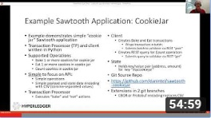

# Sawtooth Cookie Jar
Simple cookie jar example of a Sawtooth application.

## Introduction
This is a minimal example of a Sawtooth 1.1 application,
with a transaction processor and corresponding client.
This example demonstrates a simple use case, where a baker bakes or eats cookies saved in a virtual cookie jar.

A baker can:
1. bake one or more cookies to add to the cookie jar
2. eat one or more cookies in the cookie jar
3. count the cookies in the cookie jar

All cookie jar transactions have the same 6 hex digit prefix, which is the first 6 hex characters of the SHA-512 hash of "cookiejar" (that is, "a4d219").
The cookie jar is identified by `mycookiejar` with a corresponding public/private keypair.
The cookie jar count is stored at an 70 hex digit address derived from:
* a 6-hex character prefix (the "cookiejar" Transaction Family namespace) and
* the first 64 hex characters of the SHA-512 hash of the "mycookiejar" public key in hex.

## Video Presentation
I have a video presentation on YouTube that uses this application as an example. It is "Hyperledger Sawtooth Application Developer Overview using 'CookieJar'". It is at https://www.youtube.com/watch?v=VFXary3rwY0

[](https://www.youtube.com/watch?v=VFXary3rwY0)

## Components
The cookie jar transaction family contains two parts, both written in Python 3:
1. The client application has two parts:
* `pyclient/cookiejar_client.py`
contains the client class which interfaces to the Sawtooth validator via the REST API
* `pyclient/cookiejar.py` is the Cookie Jar CLI app
The client container is built with files setup.py and Dockerfile.

2. The Transaction Processor, `pyprocessor/cookiejar_tp.py`

## Docker Usage
### Prerequisites
This example uses docker-compose and Docker containers. If you do not have these installed please follow the instructions here: https://docs.docker.com/install/

**NOTE**

The preferred OS environment is Ubuntu Linux 16.04.3 LTS x64.
Although other Linux distributions which support Docker should work.

### Building Docker containers
To build TP code for Python and run the cookiejar.py example:
```
sudo docker-compose up --build
```

The `docker-compose.yaml` file creates a genesis block, which contain initial Sawtooth settings, generates Sawtooth and client keys, and starts the Validator, Settings TP, Cookie Jar TP, and REST API.


### Docker client
In a separate shell from above, launch the client shell container:
```
sudo docker exec -it cookiejar-client bash
```
You can locate the correct Docker client container name, if desired, with
`sudo docker ps` .

In the client shell you just started above, run the cookiejar.py application.
Here are some sample commands:
```
cookiejar.py bake 100  # Add 100 cookies to the cookie jar
cookiejar.py eat 50    # Remove 50 cookies from the cookie jar
cookiejar.py count     # Display the number of cookies in the cookie jar
```

To stop the validator and destroy the containers, type `^c` in the docker-compose window, wait for it to stop, then type
```
sudo docker-compose down
```

## Building and running the C++ transaction processor

For C++ TP instructions, see [cxxprocessor/](cxxprocessor/).

## Building and running on Linux (without Docker)

To run sawtooth-simplewallet without dockers, we'll have to use a Ubuntu 16.04 OS installation and compile simplewallet from sources. Below is a sample procedure for Python TP/client:


1. Install Sawtooth on an Ubuntu 16.04 LTS x64 machine. See the [Sawtooth Applications Developer's Guide](https://sawtooth.hyperledger.org/docs/core/releases/latest/app_developers_guide/ubuntu.html)
2. Create the Genesis Block. See Guide in previous step
3. Install transaction processor and client-required packages:
- listed under the `RUN` line in file `pyprocessor/Dockerfile`
- listed under the `RUN` line in file `pyclient/Dockerfile`
4. Clone the cookie jar application:
`git clone https://github.com/danintel/sawtooth-cookiejar`
5. Edit the client and transaction processor to work outside of Docker as follows:
- `cd sawtooth-cookiejar`
- Create and checkout a new git branch:
`git branch nodocker; git checkout nodocker`
- Edit file `pyprocessor/cookiejar_tp.py` and change `validator:4004` to `localhost:4004`
- Edit file `pyclient/cookiejar.py` change `rest-api:8008` to `localhost:8008`
6. Start the Validator, REST API, and Settings TP in separate terminal windows:
- `sudo -u sawtooth sawtooth-validator -vv`
- `sudo -u sawtooth sawtooth-rest-api -vvv`
- `sudo -u sawtooth settings-tp -vv`
7. Start the cookie jar transaction processor with
`./pyprocessor/cookiejar_tp.py`
8. Start the cookiejar client with
`./pyclient/cookiejar.py` and follow the "sample commands" above

## Simple Events Handler
A simple events handler is included.  To run, start the validator then
type the following on the command line:
`./events/events_client.py`

## Exercises for the User
* Add a new function, `empty` which empties the cookie jar (sets the count to 0) in the client and processor
* Add the ability to specify the cookie jar owner key (client only).  Use
[Simplewallet](https://github.com/askmish/sawtooth-simplewallet) as an example
* Replace simple CSV serialization with [CBOR](http://cbor.io/) serialization in the client and processor.
Use the Sawtooth
["inkey"](https://github.com/hyperledger/sawtooth-core/tree/master/sdk/examples/intkey_python)
example application as a pattern.
If you get stuck, see the CBOR implementation in the `cbor` branch of this repository
* Replace simple CSV serialization with [Protobuf](https://developers.google.com/protocol-buffers/) serialization in the client and processor.
Use the Sawtooth
["XO"](https://github.com/hyperledger/sawtooth-core/tree/master/sdk/examples/xo_python)
example application as a pattern
If you get stuck, see the Protobuf implementation in the `protobuf` branch of this repository
* Translate the Python transaction processor into another programming language.
See
[Simplewallet](https://github.com/askmish/sawtooth-simplewallet)
and
[Sawtooth SDK examples](https://github.com/hyperledger/sawtooth-core/tree/master/sdk/examples)
* Also translate the Python client into another programming language.
Note that the client and transaction processor do not need to be written in the same language

## Branches and Serialization Examples
* `master` is the main branch. It uses comma-separated variable (CSV) serialization
* `cbor` uses Concise Binary Object Representation (CBOR) serialization
* `protobuf` uses Protocol Buffer (Protobuf) serialization

Both the `cbor` and `protobuf` branches modify files
`pyclient/{Dockerfile,cookiejar_client.py}` and
`pyprocessor/{Dockerfile,cookiejar_tp.py}` .
The `protobuf` branch also adds files
`proto/{build.sh,cookiejar.proto,cookiejar.proto2}` .
Run `build.sh` in directory `proto` to create `cookiejar_pb2.py` .

## Contributing
This software is Apache 2.0 licensed and accepts contributions via
[GitHub](https://github.com/danintel/sawtooth-faq) pull requests.
Each commit must include a `Signed-off-by:` in the commit message (`git commit -s`). This sign-off means you agree the commit satisfies the [Developer Certificate of Origin (DCO).](https://developercertificate.org/)

This example software is derived from the
[Sawtooth Simplewallet](https://github.com/askmish/sawtooth-simplewallet)
application.
Simplewallet supports more programming languages and handles transactions with multiple keys.

## License
This example and Hyperledger Sawtooth software are licensed under the [Apache License Version 2.0](LICENSE) software license.


<br /> *Antique sawtooth cookie cutters.*

© Copyright 2018, Intel Corporation.
